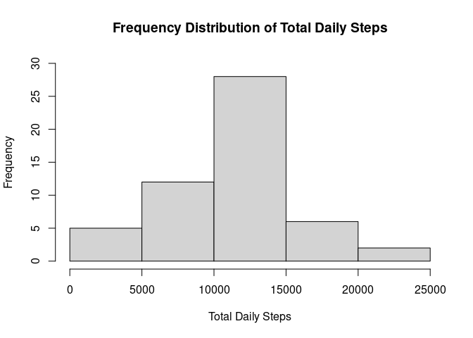
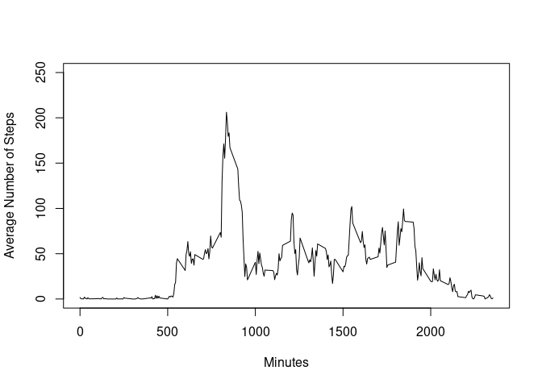
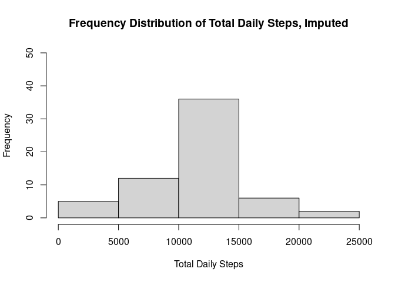
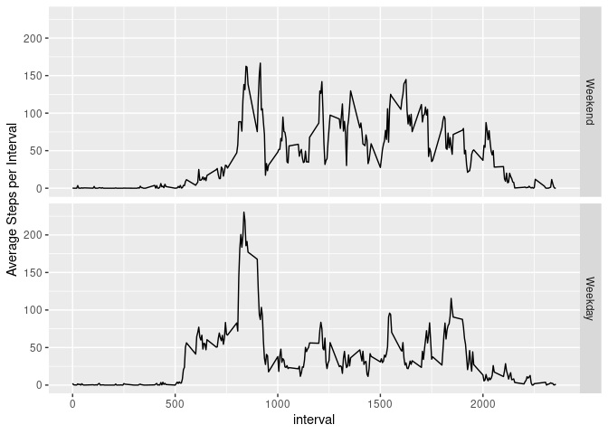

## Loading and preprocessing the data


```r
library(dplyr)
```

```
## 
## Attaching package: 'dplyr'
```

```
## The following objects are masked from 'package:stats':
## 
##     filter, lag
```

```
## The following objects are masked from 'package:base':
## 
##     intersect, setdiff, setequal, union
```

```r
home<-getwd()
file = "http://d396qusza40orc.cloudfront.net/repdata%2Fdata%2Factivity.zip"
download.file(file, "activity.zip")
unzip("activity.zip", exdir = home)
activity<-read.csv("activity.csv")
activity$date<-as.Date(activity$date, format = "%Y-%m-%d")
activitycomplete<-activity[which(complete.cases(activity)),]
```

## What is mean total number of steps taken per day?


```r
total<-activitycomplete%>%group_by(date)%>%summarize(total_steps = sum(steps))
with(total, hist(total_steps, breaks = 5, ylim = c(0, 30), main = "Frequency Distribution of Total Daily Steps", xlab = "Total Daily Steps"))
```

<!-- -->
What is the median and mean of the total daily steps?

```r
stats<-summary(total$total_steps)
print(stats[c(3,4)])
```

```
##   Median     Mean 
## 10765.00 10766.19
```

## What is the average daily activity pattern?

Let's average all the days by each time interval to see what the pattern of steps for each day is.

```r
by_interval<-activitycomplete%>%group_by(interval)%>%summarize(avg_steps = mean(steps))
with(by_interval, plot(interval, avg_steps, type = "l", xlab = "Minutes", ylab = "Average Number of Steps", ylim = c(0, 250)))
```

<!-- -->

In which time interval is the max number of steps achieved, on average?

```r
max_steps<-by_interval[which.max(by_interval$avg_steps),1]
print(max_steps[[1]])
```

```
## [1] 835
```

## Imputing missing values

How many missing values does this data set have?


```r
sum(!complete.cases(activity))
```

```
## [1] 2304
```

Let's impute the NA values by replacing them with the average number of steps for each time interval.


```r
imp<-merge(activity, by_interval, by = "interval")
for (x in 1: 17568){
  if (is.na(imp$steps[x])){
    imp$steps[x]<-imp$avg_steps[x]
  }
}
activityimp<-imp%>%select(steps, date, interval)%>%arrange(date)
```

Now that we have recreated the original dataset with none of the missing values, let's graph it and calculate the median and mean to see how our imputing has affected it.


```r
totalimp<-activityimp%>%group_by(date)%>%summarize(total_steps = sum(steps))
with(totalimp, hist(total_steps, breaks = 5, ylim = c(0, 50), main = "Frequency Distribution of Total Daily Steps, Imputed", xlab = "Total Daily Steps"))
```

<!-- -->

Notice that the pattern is exactly the same, but the middle bar, representing the most commonly achieved total number of steps, has increased from under 30 to just under 40.

To remind ourselves, here's the mean and median for the data set with the NAs removed:


```r
print(stats[c(3,4)])
```

```
##   Median     Mean 
## 10765.00 10766.19
```

What's the mean and median now?


```r
stats_imp<-summary(totalimp$total_steps)
print(stats_imp[c(3,4)])
```

```
##   Median     Mean 
## 10766.19 10766.19
```

The process of imputing the NAs has increased the median ever so slightly, but not the mean.

## Are there differences in activity patterns between weekdays and weekends?

First we categorize the dates as either weekday or weekend, and group by and summarize over each interval for either weekday or weekend.

```r
activityimp<-mutate(activityimp, wday = weekdays(date))
wd<-c("Monday", "Tuesday", "Wednesday", "Thursday", "Friday")
activityimp$wday <- factor((weekdays(activityimp$date) %in% wd), 
         levels=c(FALSE, TRUE), labels=c("Weekend", "Weekday"))
activityimp<-activityimp%>%group_by(interval, wday)%>%summarize(avg = mean(steps))
```

```
## `summarise()` has grouped output by 'interval'. You can override using the
## `.groups` argument.
```

Now, let's plot it.

```r
library(ggplot2)
sp<-ggplot(activityimp, aes(x = interval, y = avg))+geom_line()+facet_grid(wday ~.)+ylab("Average Steps per Interval")
plot(sp)
```

<!-- -->
